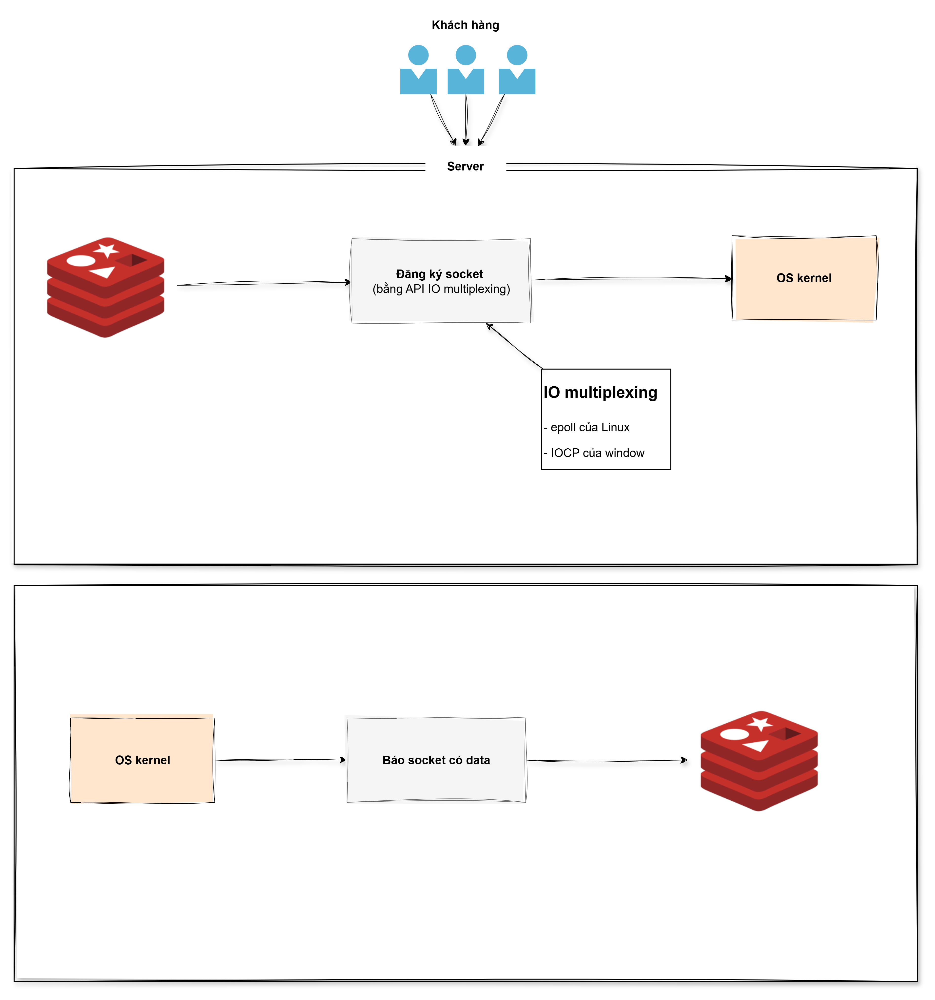

# I. Redis
- Inmemory-Database (Nhanh hơn Disk-DB)
- Single Thread
- Hỗ trợ nhiều kiểu dữ liệu low-level (Hash, List, Set, …)
- Giúp hệ thống chịu tải tốt hơn (Lớp bảo vệ) -> Nâng cao High Avaibility

# II. Cơ chế hoạt động
- Khi client kết nối Server, Redis đăng ký socket của client với OS kernel thông qua API IO multiplexing
- Khi client gửi data, OS kernel phát hiện socket sẵn sàng và thông báo cho Redis
- API IO multiplexing là cơ chế do OS kernel cung cấp (ví dụ: epoll trên Linux, IOCP trên Windows)

# III. Lưu ý
- Không thay database truyền thống
- Restart server, data trong Redis sẽ mất -> cần cấu hình persistency
- Nhất quán dữ liệu: Ghi vào Redis trước hay DB khác trước hay cùng lúc
- Redis Cluster cải thiện điểm yếu 1 luồng

# IV. Syntax
| Lệnh | Chức năng | Ví dụ | Ghi chú |
|-----|----------|------|--------|
| **SET** | Gán giá trị cho key | `SET name SonVu` | Ghi đè nếu key đã tồn tại |
| **SET + TTL** | Gán giá trị có thời gian sống | `SET name SonVu EX 60` | Tự xoá sau 60 giây |
| **TTL** | Xem thời gian sống | `TTL name` | |
| **GET** | Lấy giá trị của key | `GET name` | Trả `(nil)` nếu không tồn tại |
| **DEL** | Xoá key | `DEL name` | Trả `1` nếu xoá thành công |
| **EXISTS** | Kiểm tra key tồn tại | `EXISTS name` | `1` = có, `0` = không |
| **KEYS \*** | Liệt kê toàn bộ key | `KEYS *` | ❌ Không dùng production – block Redis thread |
| **FLUSHALL** | Xoá toàn bộ dữ liệu Redis | `FLUSHALL` | ☠️ Chỉ dùng local / test |

**List:**: ứng dụng cache 5 tin nhắn gần nhất cho ứng dụng
- Thêm:
    - lpush friends Son Ly
    - lrange friends 0 -1
    - rpush friends Nga

- Xóa:
    - lpop friends
    - rpop friends

- Select:
    - lrange friends 0 -1

**Set:**: giá trị ko trùng nhau, ko có thứ tự
- Thêm:
    - sadd hobbies "weight lifting" "power lifting"
    - lrange friends 0 -1
    - rpush friends Nga

- Xóa:
    - lpop friends
    - rpop friends

- Select:
    - smembers hobbies